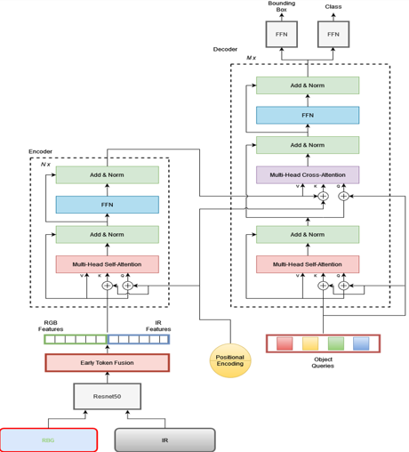
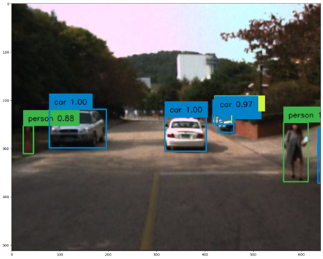
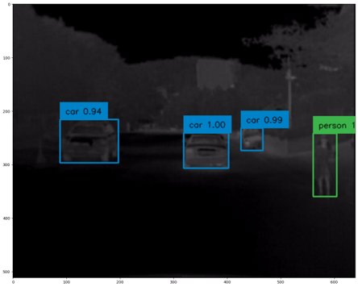
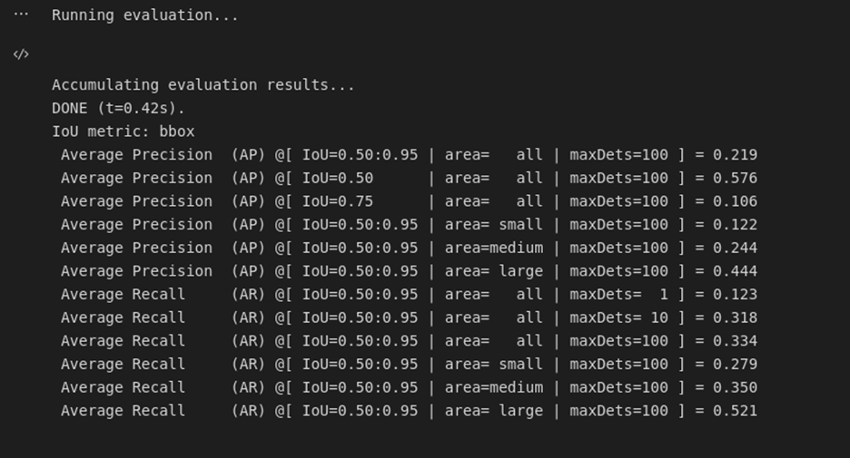

# Overview

A topic we cover in this experimentation is using Detection Transformers (DETR) as a means to conduct Multispectral Object Detection. Here we are using ResNet50 to extract features of both RGB and thermal images and then provide early token fusion by concatenating the extracted features from ResNe50 together and computing attention between the tokens of RGB and IR modalities to get learned feature representations.

# Methodology

Our methodology leverages a dual-modality approach using both RGB and Infrared (IR) images to enhance the robustness and accuracy of object detection. Both modalities assume a distinct role which provides a more holistic understanding of the object(s) of focus. The process is subdivided into three main stages, a backbone of CNN to extract the features from both RGB and Thermal IR images, a transformer architecture that consists of an encoder and decoder to learn the contextual information between the embedded features, and two classifier units to predict class and bounding box for each object detected inside an image. Here we are using ResNet50 to extract features of both RGB and thermal images and then provide early token fusion by concatenating the extracted features from ResNe50 together and computing attention between the tokens of RGB and IR modalities to get learned feature representations. Our approach relies on transformer architectures, which are powerful tools that are typically used for language tasks. The versatility of these transformers allows us to extend behavior and comprehension of the larger-scale environment.

# Architecture

# Object Detection Results

# Evaluation Results

_Please see my **project report** here_ ([Click here: Final Report](./ML%20Final%20Report.pdf))

_Please see my **presentation slides** here_ ([Click here: Slides ](./Multispectral%20Object%20Detection%20using%20DETR.pdf))

