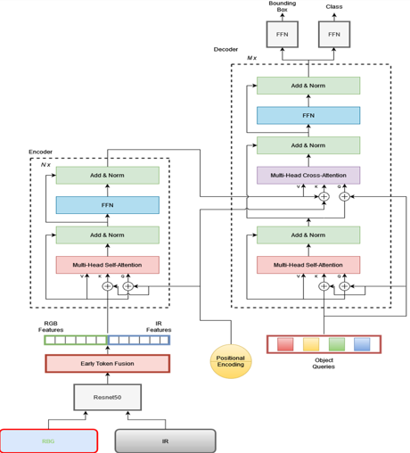

A topic we cover in this experimentation is using Detection Transformers (DETR) as a means to conduct Multispectral Object Detection. Here we are using ResNet50 to extract features of both RGB and thermal images and then provide early token fusion by concatenating the extracted features from ResNe50 together and computing attention between the tokens of RGB and IR modalities to get learned feature representations.

# Architecture

# Object Detection

# Results

